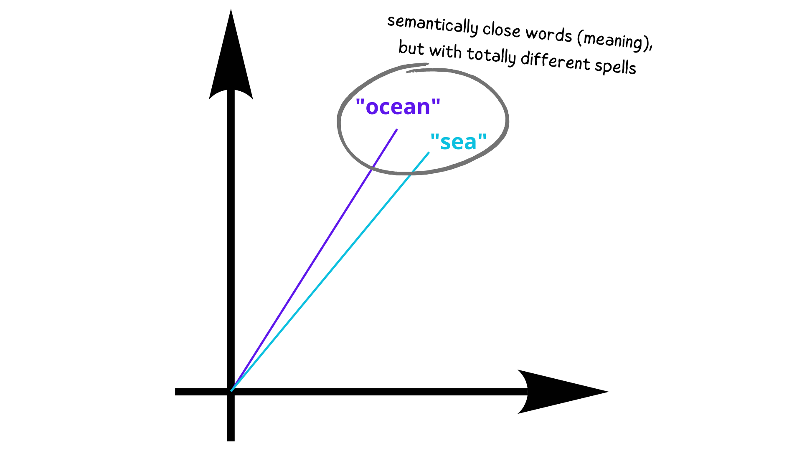
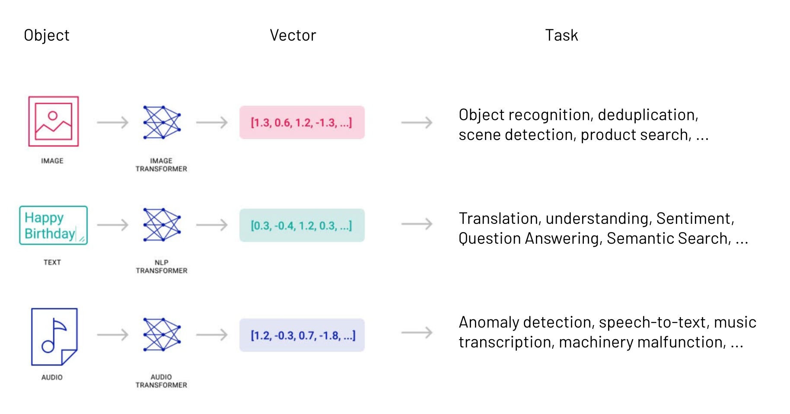
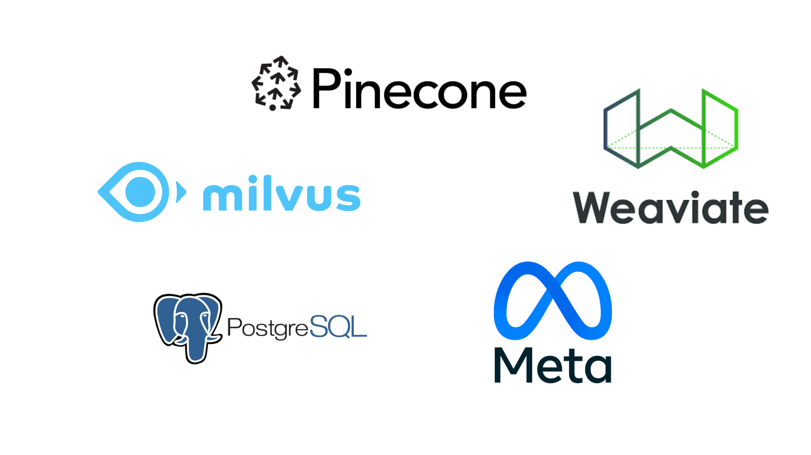

# Vector Databases


<i style="font-size: 22px; font-weight: bold; color: #666">With the rise of AI, vector databases are becoming more popular. But what exactly is a vector database and when should you use it? </i>

---

## What is a vector database?

Traditional search engines use full-text search, but NLPs like ChatGPT and Bing AI use semantic search or similarity search, a type of search that considers not only the characters match, but also the meaning of the words

* Recently Google also started using semantic search

---

<!-- _class: split -->

<div class=ldiv>

### Full-text search

- Search for a word or phrase in large amounts of text
- The search engine returns a list of documents that contain the search term

</div>


<div class=rdiv>

### Semantic search

- Search for a word or phrase in large amounts of text
- The search engine will return a list of documents that contain the search term or have a similar meaning

</div>

---

## Full-text search

```sql
SELECT title, content
FROM documents
WHERE search_vector @@ plainto_tsquery('english', 'example search');
```

---

## Semantic search



---

## How does vectorization work?

### NLP Example

- A NLP receives a text as input and returns another text as output. This involves several processing steps, one of them is vectorization.

- In the vectorization process, the **tokens** of the input text are converted into vectors using linear algebra operations. Simplifying:

A text becomes an array with numeric values, for example:

```python
"learning NLP and AI" ---> [0.9, 0.02, 0.88, 0.1, 0.3]
```

---

## How does vectorization work?

- The result of this "translation" is called a **vector** embedding. The vector embedding is a numerical representation of the input text.

- It works not only for text, but also for images, audio, and video. Each of these types of data use a different algorithm to generate the vector embedding.

---



---

## Vectorization algorithms

&nbsp;

**Images**: *vgg, resnet, inception, mobilenet, googlenet, etc.*

&nbsp;

**Text**: *word2vec, glove, fasttext, BERT, node2vec, etc.*

&nbsp;

**Audio**: *wav2vec, mxnet, etc.*

---

## Finally, the vector database!

- Now we have a lot of vectors, but these vectors are basically numbers, matrices, they don't mean anything by themselves. So the vector database is used to index these vectors.

- The vector database will index the vectors, leaving the vectors with similar values close to each other, this makes it possible to perform a similarity search in the database.

---

## How the vector database knows which vectors are similar?

1. Query the database using math to find the closest vectors in a high-dimensional space
    - Euclidean distance
    - Cosine similarity

2. Machine learning algorithms
    - K-nearest neighbors (KNN)
    - Approximate nearest neighbors (ANN)

3. Indexing

---

<h5> Let's suppose you want to search for the following text: </h5>

```python
"Best football player in the world"
```

<span style="font-size: 21px; font-weight: bold">You will very likely get results talking about Messi, because currently (2023) he was elected the best football player in the world. But you will also get results talking about Cristiano Ronaldo, Mbappé, Neymar, etc. as they are also very good football players and considered "the best" by many fans. </span>


---

## Performing a semantic search in a dataset

```python
# Load the dataset - 2000 first articles
dataset = load_dataset('openwebtext', split='train[:2000]')

# Preprocess the dataset
texts = [simple_preprocess(article['text']) for article in dataset]
# Train a Word2Vec model
model = Word2Vec(texts, vector_size=200, window=5, min_count=1, workers=4)

# Find the most similar words to "politics", "global", and "economy
similar_words = model.wv.most_similar(positive=['politics', 'global', 'economy'], topn=10)
print(similar_words)
```

- In this code, we are performing a semantic search on the terms "politics", "global", and "economy".

---

## Performing a semantic search in a dataset

```python
>>> 10 most similar results to "politics", "global", "economy"
[
    ('debt', 0.9471450448036194), 
    ('industry', 0.9427266716957092), 
    ('conflict', 0.9362503290176392), 
    ('labor', 0.9333578944206238), 
    ('scientific', 0.9326208829879761), 
    ('investment', 0.9326040148735046), 
    ('capitalism', 0.9312210083007812), 
    ('participation', 0.9291972517967224), 
    ('society', 0.9280529618263245), 
    ('crisis', 0.9253469705581665)
]
```

---

## Performing a semantic search in a dataset

Complete code: [https://github.com/josethz00/vector-databases-talk/blob/main/semantic-search.py](semantic-search.py)

---

## Most popular vector databases

- [Faiss (by Meta)](https://ai.facebook.com/tools/faiss/)

- [Pinecone](https://www.pinecone.io/)

- [Milvus](https://milvus.io/)

- [Postgres (pg_vector)](https://github.com/pgvector/pgvector/)

- [Weaviate](https://www.weaviate.io/)



---

# Thank you!

<style>
@import 'https://maxcdn.bootstrapcdn.com/font-awesome/4.7.0/css/font-awesome.min.css';
</style>

Thank you for your attention. I hope you enjoyed this talk. If you have any questions, please feel free to contact me.

  <a href="https://www.linkedin.com/in/jose-thomaz/" target="_blank" style="margin-right: 20px;"><i class="fa fa-linkedin fa-3x" aria-hidden="true"></i>@jose-thomaz</a>

  <a href="https://www.twitter.com/josethz00" target="_blank" style="margin-right: 20px;"><i class="fa fa-twitter fa-3x" aria-hidden="true"></i>@josethz00</a>

  <a href="https://github.com/josethz00" target="_blank" style="margin-right: 20px;"><i class="fa fa-github fa-3x" aria-hidden="true"></i>@josethz00</a>